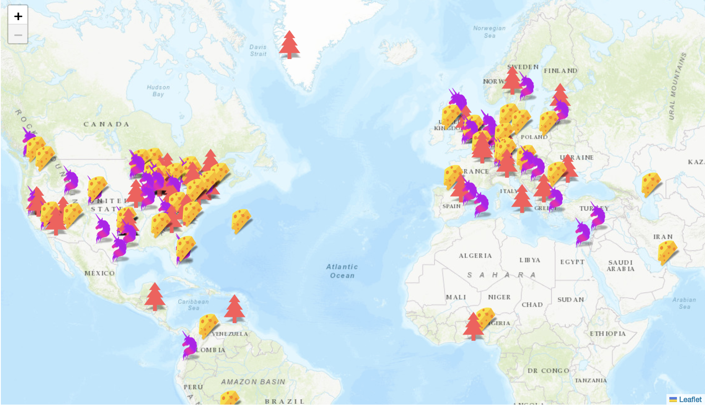
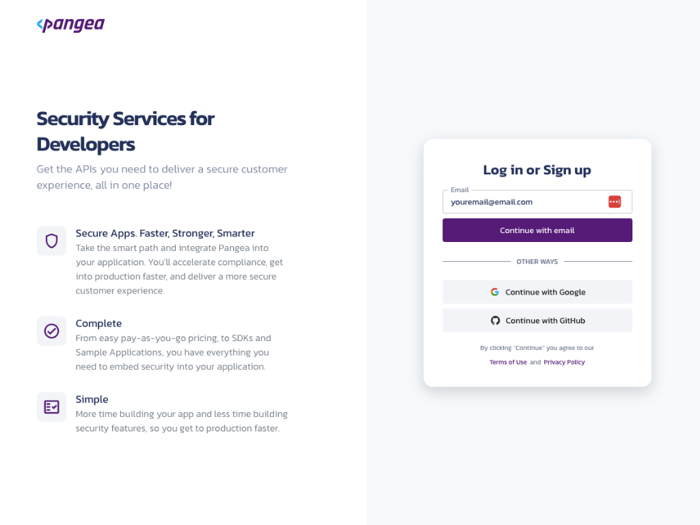
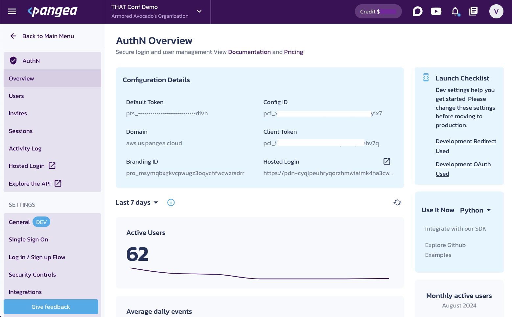

# Overview

This is a [Next.js](https://nextjs.org/)  app that shows where logins are located, whether they have a VPN or a Proxy, and the timestamp.



This is possible due to Pangea's:

- [Authentication](https://pangea.cloud/services/authn/) to access the map demo.
- [IP Intel](https://pangea.cloud/services/ip-intel/reputation/) to detect if the login was thru a VPN or Proxy and where the user is geolocated
- [Secure Audit Log](https://pangea.cloud/services/secure-audit-log/) to log the sign-ins and additional infomration

## Getting Started

- [Pre Reqs Check](#pre-reqs-check)
- [Enable Pangea Services](#enable-pangea-services)
- [First Run](#first-run)
- [Learn More](#learn-more)
- [Deploy on Vercel](#deploy-on-vercel)

## Pre Reqs Check

In order to run this application you are going to need:

- [Node](https://nodejs.org/en)
- [Pangea Account](https://pangea.cloud/)

## Enable Pangea Services

1. Create and sign into your [Pangea account](https://pangea.cloud)


2. Once you land on the Pangea User Console, You can see AuthN, Secure Audit Log, and IP Intel on the left.
3. Select **AuthN** to enable and begin the token creation process.
4. Landing on the **AuthN Service Overview** page you'll see all the token information you will need from Pangea to run the application. Copy these values into a note pad or keep this page open.


5. Go to the General tab and navigate to the Redirects section. Add the necessary redirect.
   - If running in a codespace, it's the url of your codespace running instance.

   - If running this app locally, add [http://localhost:3000](http://localhost:3000) to the redirect list. This is also go to a good time to go to General Settings and decide what methods of Login or MFA you need for your application. On first run it is recommended to do this in a bare bones way.

   > NOTE: By going to **Customize > View project branding**, you'll be able to customize your login page

6. In the General tab, enable the **Activity Log**. This is how the Map will pull down the data necessary for the pins.

7. Go to Security Controls and enable  IP Intel Check.

## First Run

1. Copy the appropriate values into the .env file.
    - Pangea Service Token
    - Pangea Domain
    - Pangea AuthN Client Token
    - Pangea Hosted Login URL
    - Pangea Config ID

2. Run the development server:

    ```bash
    npm run dev
    ```

3. Open [http://localhost:3000](http://localhost:3000) with your browser to see the result.

4. Login to the demo and see the map!

## Learn More

To learn more about Next.js, take a look at the following resources:

- [Next.js Documentation](https://nextjs.org/docs) - learn about Next.js features and API.
- [Learn Next.js](https://nextjs.org/learn) - an interactive Next.js tutorial.

You can check out [the Next.js GitHub repository](https://github.com/vercel/next.js/) - your feedback and contributions are welcome!

## Deploy on Vercel

The easiest way to deploy your Next.js app is to use the [Vercel Platform](https://vercel.com/new?utm_medium=default-template&filter=next.js&utm_source=create-next-app&utm_campaign=create-next-app-readme) from the creators of Next.js.

Check out our [Next.js deployment documentation](https://nextjs.org/docs/deployment) for more details.
